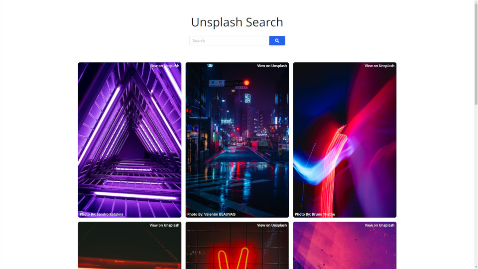

# unsplash-svkit

:camera: unsplash search using sveltekit

requirements: [unsplash developer api key](https://unsplash.com/developers)

add unsplash developer key to `.env` file in base of project

    PUBLIC_API_CLIENTID="insert-api-key-here"

created as a working example of sveltekit & is based on [unsplash-js-search
](https://github.com/equk/unsplash-js-search) (unsplash search using vanillajs)

## screenshot

## unsplash references

- https://unsplash.com/documentation
- https://unsplash.com/api-terms

# contact

Website: https://equk.co.uk

Twitter: [@equilibriumuk](https://twitter.com/equilibriumuk)

### notes

> Unsplash API Terms (Attribution)
>
> Each time you or your Developer App displays a Photo, your Developer App must attribute Unsplash, the Unsplash photographer, and contain a link back to the photographer’s Unsplash profile.
